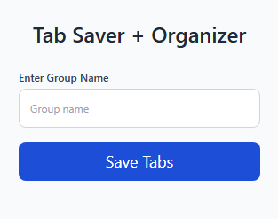

# Tab Saver + Organizer 🔖

A simple and powerful Chrome Extension to **save and organize your open tabs into named groups**, so you can reopen them anytime and stay productive.

---

## 🚀 Features

- ✅ Save all current open tabs with a single click
- ✅ Organize tabs into custom groups
- ✅ Reopen tab groups anytime
- ✅ Delete saved tab groups
- ✅ Clean and modern UI using Tailwind CSS
- ✅ Backend powered by Node.js (no database required)

---

## 📸 Preview



---

## 🧰 Tech Stack

- **Chrome Extension API (Manifest V3)**
- **HTML/CSS + TailwindCSS**
- **JavaScript (Vanilla)**
- **Node.js + Express.js (for backend)**
- **JSON file-based storage**

---

## 📦 Installation (Development)

### 🔧 Prerequisites

- [Node.js](https://nodejs.org/)
- Google Chrome (latest)
- Chrome Developer Mode enabled

---

### 🖥️ Backend Setup

1. Clone the repository:
   ```bash
   git clone https://github.com/sheix-khizar/Tab-Saver_Chrome-Extension.git
   cd tab-saver-extension/server
   ```

2. Install dependencies:
   ```bash
   npm install
   ```

3. Run the server:
   ```bash
   node server.js
   ```

> Server will run at `http://localhost:3000`

---

### 🧩 Load Chrome Extension

1. Open **Chrome** and navigate to: `chrome://extensions`
2. Enable **Developer Mode** (top right)
3. Click **"Load unpacked"** and select the `extension` folder from the repo

---

## 🗂️ Folder Structure

```
tab-saver-extension/
├── extension/         # Chrome extension files (HTML, JS, CSS)
├── server/            # Node.js + Express backend
│   ├── data/          # JSON file for tab group storage
│   └── server.js      # Express server file
├── README.md
└── preview.png        # Screenshot or preview image
```

---

## 🛠️ API Endpoints

| Method | Endpoint              | Description            |
|--------|-----------------------|------------------------|
| POST   | `/save-group`         | Save a new tab group   |
| GET    | `/groups`             | Get all saved groups   |
| DELETE | `/groups/:groupName`  | Delete a group by name |

---


---

## 💡 Inspiration

Built to improve tab management and browser productivity with a beautiful UI and local backend.

---

## 🙌 Support

Feel free to submit issues or feature requests. Contributions welcome!
